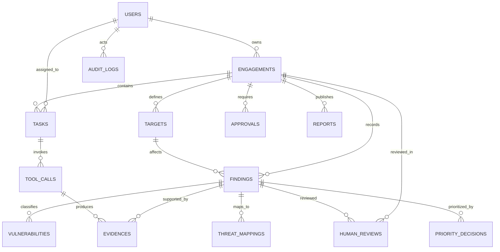

# REVEN — Initial Data Model

```mermaid
erDiagram
  USERS ||--o{ ENGAGEMENTS : owns
  USERS ||--o{ TASKS : assigned_to
  ENGAGEMENTS ||--o{ TARGETS : defines
  ENGAGEMENTS ||--o{ TASKS : contains
  ENGAGEMENTS ||--o{ FINDINGS : records
  TARGETS ||--o{ FINDINGS : affects
  TASKS ||--o{ TOOL_CALLS : invokes
  ENGAGEMENTS ||--o{ APPROVALS : requires
  FINDINGS ||--o{ VULNERABILITIES : classifies
  FINDINGS ||--o{ EVIDENCES : supported_by
  TOOL_CALLS ||--o{ EVIDENCES : produces
  ENGAGEMENTS ||--o{ REPORTS : publishes
  ENGAGEMENTS ||--o{ HUMAN_REVIEWS : reviewed_in
  FINDINGS ||--o{ HUMAN_REVIEWS : reviewed
  FINDINGS ||--o{ THREAT_MAPPINGS : maps_to
  FINDINGS ||--o{ PRIORITY_DECISIONS : prioritized_by
  USERS ||--o{ AUDIT_LOGS : acts
```

The ERD is a conceptual view; the authoritative column definitions, constraints, and indexes are in `database/migrations/0001_initial_schema.sql`.
